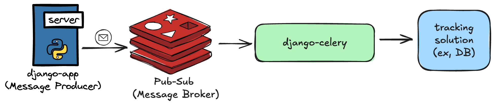

# django-celery
learning django celery for background jobs

## When to use celery ? 
So Celery is basically a Go routine !

- running ML modeld
- sending confirmation emails
- Processing images or Generating reports

## Celery Tasks Features: 


## Solution Arch:


## Work setup : 
- created django project
- containarized the proejct and mounted it to a volume inside the container
- reuse the same codebase to django celery by deploying a celery app instance referencing the same codebase 
- now to start an app :
    - opened a shell session inside the django_app server container 
    ```shell
    ╰─ docekr exec -it django_app /bin/sh
    ```
    - created the app 
    ```shell
    ╰─ ./manage.py startapp celeryworker
    ```
- since that i didn't define a port and command to start the instance of code that i used in celery container .. the `manage.py` file which is the entry point won't be executed, but this file contains the main function that let the app access the environment variables .. so we will need to initiate this setup somehow and somewhere into our project and i will do this in the `celery.py` file

## Communication Flow between apps : 


## Routing Techniques : 
